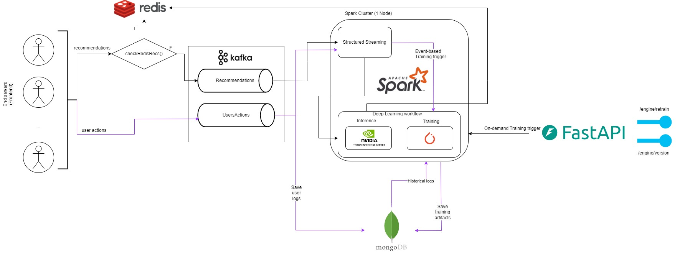

# recsys-streaming

`recsys-streaming` imitates fragment of a real-world recommender system using PyTorch for modeling, Kafka for streaming data, Spark for data processing, Structured Streaming for receiving stream from Kafka, and MongoDB for data storage, Redis for recommendations storage. The system exposes its functionalities as a FastAPI service, enabling easy interaction with the recommender system.

# Components
- PyTorch: Model serving recommendations based on `Amazon Reviews'23` dataset

- Kafka Streaming: The system consumes batch data from one Kafka topic and can retrain itself using data from another Kafka topic.

- Spark Data Processing: Data processing tasks.

- Structured Streaming: Retrieving data from Kafka topics.

- MongoDB Database: Data storage for behavioral data (clicks, logs) and recommendation data.

- FastAPI: REST API

- Redis: Returning recommendation lists to users

# System Architecture



# Dataset
The project utilizes the Amazon Reviews'23 dataset, which can be found [here](https://amazon-reviews-2023.github.io/). For the sake of experiments data has been divided in parts to create basis for training and data streaming tasks.

# Usage

**1. Clone repository**
```bash
git clone https://github.com/milymilek/gnn-rl-recsys.git
```

**2. Installation**
```bash
docker network create --driver bridge recsys-streaming_kafka_network
```

```bash
docker-compose -f recsys-streaming/docker-compose.yml up --build
```

```bash
docker-compose up --build
```

**3. Demo (for Windows only)**
```powershell
./demo.ps1
```

```powershell
make stream_recommendations
```

```powershell
make stream_retrain
```

