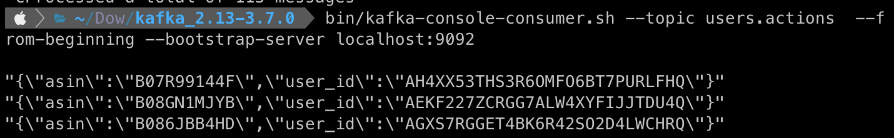

# Kafka setup

* Usage
    ```bash
    docker-compose up
  
* This confguration should create 3 containers with zookeeper, kafka and producer service.
* Kafka container is setup to open 2 ports (docker internal for producer service and external in order to debug kafka broker).
* To connect to external port use above method (download kafka client scripts from https://www.apache.org/dyn/closer.cgi?path=/kafka/3.7.0/kafka_2.13-3.7.0.tgz) in localhost env after building container: 
  ```bash
  bin/kafka-console-consumer.sh --topic users.actions  --from-beginning --bootstrap-server localhost:9092
  ```
  * After some time you shoud see messages produced by mock-data-producers.
  
  